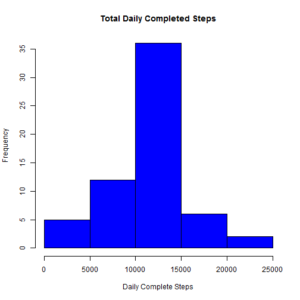

# Reproducible Research: Peer Assessment 1 

## Analyzing Personal Movement Activity Data

It is now possible to collect a large amount of data about personal movement using 
activity monitoring devices such as a Fitbit, Nike Fuelband, or Jawbone Up.

## Introduction

This assignment makes use of data from a personal activity monitoring device. 
This device collects data at 5 minute intervals through out the day. 
The data consists of two months of data from an anonymous individual collected 
during the months of October and November, 2012 and include the number of steps taken in 
5 minute intervals each day.

## Data
Dataset: [Activity monitoring data] (https://d396qusza40orc.cloudfront.net/repdata%2Fdata%2Factivity.zip) [52K]

The variables included in this dataset are:

1. **steps:** Number of steps taking in a 5-minute interval (missing values are coded as NA)

2. **date:** The date on which the measurement was taken in YYYY-MM-DD format

3. **interval:** Identifier for the 5-minute interval in which measurement was taken

The dataset is stored in a comma-separated-value (CSV) file and there are a total of 
17,568 observations in this dataset.


Here's the [Original Github repository] (https://github.com/rdpeng/RepData_PeerAssessment1) 
for this assignment.

## Loading and PreProcessing the Data

Data is read from a zip file called **repdata-data-activity.zip**. 

It is assumed that the (zip) file is downloaded, from the above URL, into the current working 
directory, before running the code below.


```r
act <- read.csv(unz("repdata-data-activity.zip", "activity.csv"),
                                   header=T, 
                                   sep=",", 
                                   na.strings="NA", 
                                   stringsAsFactors=F)
```

This is how the data appears,


```r
str(act)
```

```
## 'data.frame':	17568 obs. of  3 variables:
##  $ steps   : int  NA NA NA NA NA NA NA NA NA NA ...
##  $ date    : chr  "2012-10-01" "2012-10-01" "2012-10-01" "2012-10-01" ...
##  $ interval: int  0 5 10 15 20 25 30 35 40 45 ...
```

## 1: What is mean total number of steps taken per day?

Include **dplyr** package. Create a new date variable. Summrize **Total Steps** by date


```r
library(dplyr)
act$date2 <- as.Date(act$date,"%Y-%m-%d")
dailySteps <- act %>% group_by(date2) %>% summarize(totalSteps = sum(steps, na.rm=TRUE))
```

Now print the histogram of the total number of steps taken each day.


```r
hist(dailySteps$totalSteps, col="blue", xlab="Daily Steps", 
               main="Total Daily Steps")
```

 

And report the **mean** and **median** of the total number of steps taken per day


```r
mean(dailySteps$totalSteps)
```

```
## [1] 9354.23
```

```r
median(dailySteps$totalSteps)
```

```
## [1] 10395
```

```r
summary(dailySteps$totalSteps)
```

```
##    Min. 1st Qu.  Median    Mean 3rd Qu.    Max. 
##       0    6778   10400    9354   12810   21190
```


## 2: What is the average daily activity pattern?

Average,number of steps taken, by 5 minute interval, across all days.


```r
intervalSteps <- act %>% group_by(interval) %>% summarize(averageSteps = mean(steps, na.rm=TRUE))
```

Here's how they appear,


```r
str(intervalSteps)
```

```
## Classes 'tbl_df', 'tbl' and 'data.frame':	288 obs. of  2 variables:
##  $ interval    : int  0 5 10 15 20 25 30 35 40 45 ...
##  $ averageSteps: num  1.717 0.3396 0.1321 0.1509 0.0755 ...
##  - attr(*, "drop")= logi TRUE
```

Plot the chart of average number of steps taken, averaged across all days by 5 minute interval,


```r
plot(intervalSteps$interval, intervalSteps$averageSteps, type="l", col="blue", lwd=2, 
               xlab="Interval",
               ylab="Average Steps",
               main="Average Steps Taken By 5 Minute Interval")
```

 

Now, to calculate, which 5-minute interval, on average across all the days in the dataset, 
contains the maximum number of steps, **arrange** the dataset by **averageSteps descending**,


```r
head(arrange(intervalSteps, desc(averageSteps)))
```

```
## Source: local data frame [6 x 2]
## 
##   interval averageSteps
## 1      835     206.1698
## 2      840     195.9245
## 3      850     183.3962
## 4      845     179.5660
## 5      830     177.3019
## 6      820     171.1509
```

So, the answer is, interval **835** has maximum average steps of **206.1698**.

## 3: Imputing missing values

There are a number of days/intervals where there are missing values (coded as NA). 
The presence of missing days may introduce bias into some calculations or summaries of the data.

This is how we calculate the total number of missing values in the dataset,


```r
sum(is.na(act$steps))
```

```
## [1] 2304
```
So there are **2304** NA Observations in the dataset. 

Now we need to devise a strategy for filling in all of the missing values in the dataset.
We have already calculated **Average Number Of Steps** across All Days for each of the 
**5 Minute Intervals**. 

The strategy we will follow is,
- We will scan through all observations for variable **steps**
- If particular value is **NOT** "NA", there is no action needed
- If it is **NA**, we will find out, which **interval** it belongs to
- We will get **Average Number Of Steps** across all days, for **that particular** interval
- We will substitute the **NA** value, with the mean of that **5 minute interval**

Start with creating a new dataset,


```r
actComplete <- act
```

Now, apply the strategy discussed above to the new dataset,


```r
for (i in 1:nrow(actComplete)) {
   if (is.na(actComplete[i,]$steps)) {
         a <- actComplete[i,]$interval
         b <- round(subset(intervalSteps, interval==a)$averageSteps)
         actComplete[i,]$steps <-    b
   }
}
```

Summarize **Total Steps** by date, in the new dataset,


```r
dailyStepsComplete <- actComplete %>% group_by(date2) %>% 
                         summarize(totalStepsComplete = sum(steps))
```

Now make a histogram of the total number of steps taken each day, based on the **Complete** data,


```r
hist(dailyStepsComplete$totalStepsComplete, col="blue", xlab="Daily Complete Steps", 
               main="Total Daily Completed Steps")
```

 

Let's view the two histograms side-by-side,


```r
par(mfrow = c(1, 2), oma=c(0,0,2,0))
hist(dailySteps$totalSteps, col="green", xlab="Daily Steps",main="with NAs")
hist(dailyStepsComplete$totalStepsComplete, col="blue", xlab="Daily Complete Steps",
                           main="with NAs imputed")
mtext("Total Daily Steps", outer = TRUE, font=2)
```

 

Now, let's find out the impact of imputing missing data, on the estimates of the total daily number
 of steps,


```r
sum(dailySteps$totalSteps)
```

```
## [1] 570608
```

```r
sum(dailyStepsComplete$totalStepsComplete)
```

```
## [1] 656704
```

```r
sum(dailyStepsComplete$totalStepsComplete) - sum(dailySteps$totalSteps)
```

```
## [1] 86096
```

```r
summary(dailySteps$totalSteps)
```

```
##    Min. 1st Qu.  Median    Mean 3rd Qu.    Max. 
##       0    6778   10400    9354   12810   21190
```

```r
summary(dailyStepsComplete$totalStepsComplete)
```

```
##    Min. 1st Qu.  Median    Mean 3rd Qu.    Max. 
##      41    9819   10760   10770   12810   21190
```

As you can see, because of the **imputing** of NA values for Daily Steps, 
- We have added **86096** new steps
- the **Min** has gone up from **0** to **41**
- the **1st Quartile** has gone up from **6778** to **9819**
- the **Median** has gone up from **10400** to **10760**
- the **Mean** has gone up from **9354** to **10770**
- there is no change in **3rd Quartile** and **Max** values


## 4:  Are there differences in activity patterns between weekdays and weekends?

For this part of the assignment, we shall use the dataset with the filled-in missing values.

We shall first create a new factor variable in the dataset with two levels “weekday” and “weekend” 
indicating whether a given date is a weekday or weekend day.

Let's add two new variables to our dataset. **First one**, with Short Weekday. 
**Second one**, with Long Weekday. Later on, we will update the second variable, with 
“weekday” or “weekend”.


```r
actComplete <- mutate(actComplete, dayOfWeek = weekdays(date2, abbr=TRUE),
                                   day = weekdays(date2))
```

Now let's update the **second** variable.


```r
for (i in 1:nrow(actComplete)) {
   if (actComplete[i,]$dayOfWeek %in% c("Mon","Tue", "Wed","Thu","Fri")) {
         actComplete[i,]$day <- c("weekday")
   } else if (actComplete[i,]$dayOfWeek %in% c("Sat","Sun")) {
         actComplete[i,]$day <- c("weekend")
   }
}
```

Let's convert it to **factor** now


```r
actComplete$day <- factor(actComplete$day)
```

It's time to **Group By** the dataset with **day** and **interval** now. And to calculate 
**Average Steps**


```r
intervalStepsDay <- actComplete %>% group_by(day, interval) %>% 
                            summarize(averageStepsDay = mean(steps))
```

Finally, let's make a panel plot containing a time series plot.


```r
library(ggplot2)
g <- ggplot(intervalStepsDay, aes(interval, averageStepsDay))
g <- g  +
     geom_line(color="blue") +
     facet_grid(day~.) +
     labs( x = "Interval") +
     labs( y = "Number of steps") +
     labs( title = "Average Steps Taken on Weekdays / Weekends") +
     theme(plot.title = element_text(face="bold", size=16),
           axis.title.x = element_text(face="bold", size=12),
           axis.title.y = element_text(face="bold", size=12),
           strip.text.y = element_text(face="bold", size = 12),
           strip.background = element_rect(fill="orange")) 
print(g)
```

 

This completes our analysis. 

Thank You for participation.

